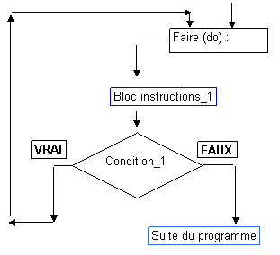

### It's ricard time ?

### Explications 

L'instruction `do{ ... } while()` traduite par : 'répéter / faire ... tant que' est une alternative à l'instruction while().

Elle permet de tester la condition après la première itération et exécution du premier bloc d'instructions. 

Dans le cas de la boucle while, la condition est examinée avant la boucle tandis que pour la boucle do-while elle est examinée à la fin. Ainsi, même si cette condition n'est pas vérifiée, la boucle s'exécutera au moins une fois.



#### Syntaxe :

```php
<?php

do {
  // Bloc d'instructions;
} while(condition);
```

--- 

#### Exemple :

```php
<?php

// Déclaration et initialisation du compteur
$i = 0;
// Boucle générant la table de multiplication du 8
do {
  echo "8 x ". $i . " = " . ( 8 * $i) . "\n";
  $i++; // Incrémentation du compteur
} while($i <= 10);
```

> Remarques: Il existe deux instructions qui permettent de modifier l'exécution des boucles, il s'agit de `break` et de `continue`.

---

#### Break && continue

L'instruction break permet de sortir de la boucle courante. C'est-à-dire qu'il interrompe directement l'itération. La condition de boucle est une condition qui est toujours vérifiée et, dans la boucle, on utilise break pour quitter celle-ci une fois que l'on est arrivé à nos fins.

`break` permet aussi de gérer des événements plus exceptionnels, comme des erreurs : 
- En cas d'erreur, on quitte la boucle et on affiche un message.

La seconde instruction est l'instruction `continue`. Cette instruction permet de sauter les instructions de l'itération courante, afin de passer directement à l'itération suivante.

Prenons un exemple sur les nombres pairs. Cette fois-ci, la variable $i sera incrémentée de 1. On utilisera l'instruction continue pour éviter les nombres impairs.

```php
<?php

$i = 0;

do {
  if (!($i % 2)) {
   continue;
  }

  echo $i . "\n";
  $i++ ;
} while($i < 20);
```

### Instructions

Créer une variable nommée `$nbrRicard`.

A l'aide de l'instruction `do{ ... } while()`, écrire un script qui va incrémenter le nombre de ricard bu en respectant les conditions suivantes.

- Avant chaque ricard bu affiché : Allez hop ricard numéro + le numéro du ricard actuel
- Au 3ème ricard affichez : Il va bientôt falloir que j'arrête !
- Au 5ème ricard affichez : Je suis plus très frais...
- Au 7ème ricard stopper la boucle.

**Attention ! Ne pas oublier de sauter une ligne a la fin chaque echo**

### Notions

- [do while](https://www.php.net/manual/fr/control-structures.do.while.php)
