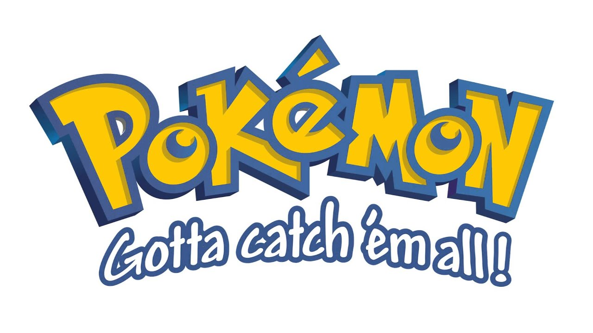

### Pookemon

Here is the last straight line of this `PHP8` pool !



### Instructions

The idea of this raid is to create a bot that will simulate a pokemon fight / capture.

By group of 2️⃣

#### Pokémon

Create a class named `Pokemon`.

Parameters :
- name: name of the pokemon
- life: maximum pv of the pokemon
- currentLife: current pokemon pv
- level: level of the pokemon
- type: type of the pokemon
- strength: strength of the pokemon

Functions:
- attack($pokemon): int | float: attack a pokemon
- hit $damages): int | float: takes damages
- heal($heal): int | float: heal
- isDead(): bool: check if the pokemon is dead
- levelUp(): void: allows you to gain a level
- sayHello(): void: say hello

The `sayHello` function must be called each time a new pokemon is instantiated.

Make sure that we cannot create a Pokemon item.

Create three new classes to implement the Bulbasaur, Squirtle and Charmander starter.

---

#### Pokeball

Create a class named `Ball`

Settings :
- name: name of the pokéball
- level: level of the pokéball

Functions:
- tryCatch ($pokemon): bool: try to catch a pokemon

Make sure that we can't create a Ball object.

Create four new classes to implement the Pokeball, Superball, Hyperball and Masterball balls.

---

#### Potions

Create a class named `Heal`

Parameters :
- name: name of the potion
- heal: number of pv returned

Functions:
- use($pokemon): bool: heal a pokemon

Make sure that we can't create a Heal item.

Create three new classes to implement the ball Potion, Superpotion and Potionmax.

---

#### Bot

Create a class named `Bot`

Parameters :
- pokemon: the pokemon used for combat
- enemy: the enemy pokemon
- bag: an array containing the different objects

Functions:
- countInBag($ bject): int: count the number of object passed in parameter in the bag
- removeFromBag($object): bool: remove an object from the bag
- getInBag($object): bool | object: get an object in the bag, otherwise false if it is not there
- couldKill($atackant, $attacked): bool: check if a pokemon can knock out another one
- captureProbabillity(): int: gives the probability of capturing a pokemon
- tryCapture(): bool: try to capture a pokemon
- heal($pokemon, $potion): int | float: heal a pokemon
- attack(): attack a pokemon
- play(): bool : launch the bot

`Logic play()` : 

- If we are sure to capture, do it in priority
- If we can die in 2 turn or less, check if we can heal
- If we have potion, and potion can heal more than enemy damage
- Else, if we have superpotion, and superpotion heal more than enemy damage
- If we can die, try to capture anyway
- If we risk to kill enemy, we dont attack
- If we cannot do anything better, we attack

#### Formulas

- Combat: An attack inflicts: strength * (rand(900, 1100) / 1000), rounded up to the whole number.


- Capture: The chances of capturing a pokemon are:
  (($life - $currentLife) / $life) * (1 + ($lvlPokeball - $lvlPokemon) / 25) over 1, rounded to the hundredth.


- Potions: They restore, 20, 50, 200 and 100% of the health.


- Balls: They are lvl 10, 30 and 50. The masterball captures every time.


- Pokemons:
    - Squirtle: 9 life per lvl and 2 attack.
    - Charmander: 5 of life per level and 4 of attack.
    - Bulbasaur: 7 life per lvl and 3 attack

#### Simulate

Create a bot seeking to capture a pokemon during a fight.

In this fight, you have 3 pokeballs, 2 potions and a super potion.

You have a level 5 Squirtle and you fight a level 8 Charmander.

Charmander attacks every turn.

Code to test your solution:

```php
echo "You summon Squirtle". PHP_EOL;
$squirtle = new Squirtle(5);

echo "Your enemy summons a Charmander". PHP_EOL;
$charmander = new Charmander(8);

$bag = [];
$bag[] = new Potion();
$bag[] = new Potion();
$bag[] = new Superpotion();
$bag[] = new Pokeball();
$bag[] = new Pokeball();
$bag[] = new Pokeball();

$bot = new Bot($squirtle, $charmander, $bag);

echo PHP_EOL;
echo PHP_EOL;
echo 'Start of the fight !' . PHP_EOL;
echo '-----------------'. PHP_EOL;
echo PHP_EOL;

$myTurn = (bool) rand(0,1);

$end = false;
while (!$end) {
    echo ($ myTurn? 'It's your turn :': 'It's your opponent \'s turn '). PHP_EOL;
    echo "Squirtle :". $squirtle->currentLife. "PV - Charmander :". $charmander->currentLife. "PV". PHP_EOL;

    if ($myTurn) {
      $captureSuccess = $bot->play();
      if ($captureSuccess) {
         $end = true;
      }
    } else {
        $damages = $charmander->attack($squirtle);
        echo $charmander-> name. 'attack'. $squirtle->name. 'and inflicts'. $ damages. 'damage.' . PHP_EOL;
    }

    if ($squirtle->isDead() || $charmander->isDead()) {
       $end = true;
    }

    echo "\n\n";

    $myTurn =! $myTurn;
}

echo '-----------------'. PHP_EOL;

if ($captureSuccess ?? false) {
   echo 'Well done, you\'ve captured Charmander !' . PHP_EOL;
   echo 'That was a hell of a fight!' . PHP_EOL;
} elseif ($squirtle->isDead()) {
   echo 'Failed! Your Squirtle is KO! ' . PHP_EOL;
} elseif ($charmander->isDead()) {
   echo 'Failed! You knocked out poor Charmander !' . PHP_EOL;
}

echo '-----------------'. PHP_EOL;
echo PHP_EOL;
echo 'End of the fight
```